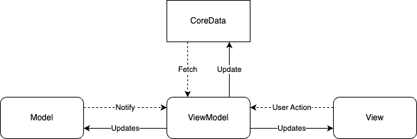
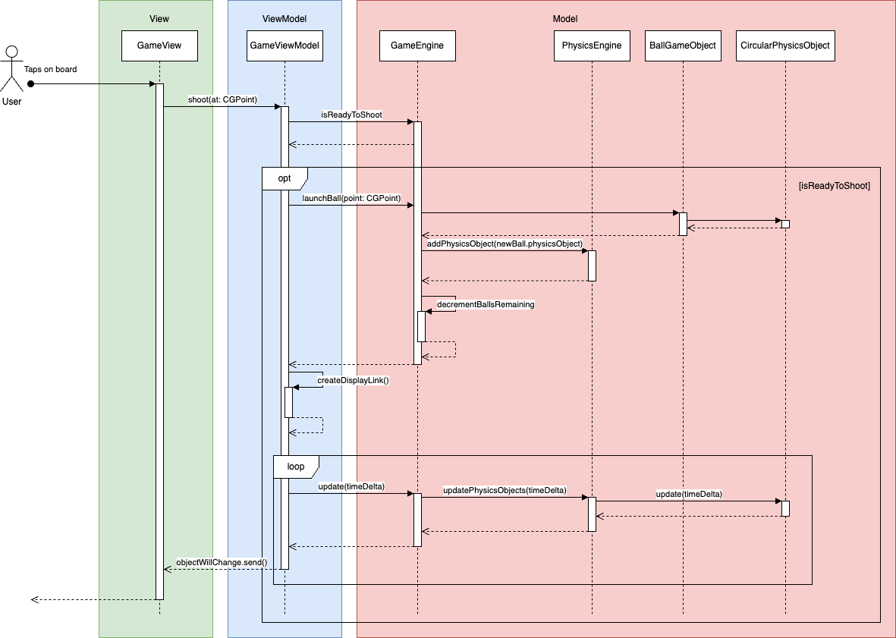

# PeggleClone Developer Guide

## Architecture

PeggleClone is an IOS game developed using SwiftUI using the MVVM (Model-View-ViewModel)
architecture.

There exist 3 main parts

1. Peggle game
2. Level Seletor for the peggle game
3. Level Designer for the designing your own levels

PeggleClone uses the observer pattern where GameViewModel is an observable object which GameView observes for changes and renders.

The diagram above gives a high level view the architecure

## Class Diagram

### Game

_^Overview of Game class diagram_

_^Overview of GameView class diagram_

_^Overview of GameEngine class diagram_

### LevelSelector

_^Overview of LevelSelector class diagram_

### CoreData

_^Overview of CoreData class diagram_

### LevelDesigner

_^Overview of CoreData class diagram_

## Classes/Object structure

### Model

-   Contains the data and logic for the program which is retrieved by the ViewModel upon its
    recept of input by View.
-   Interacts with ViewModel only.

**`Peg`**

-   Contains data that represents a peg on the gameboard.
-   Contains the position on board, type, rotation, and diameter as properties.
-   All pegs must belong to one gameboard.
-   Peg data is saved as `PegEntity` in CoreData.
-   Passed into GameEngine to load a PegGameObject.

**`Block`**

-   Contains data that represents a block on the gameboard.
-   Contains the position on board, rotation, and size as properties.
-   All blocks must belong to one gameboard.
-   Block data is saved as `BlockEntity` in CoreData.
-   Passed into GameEngine to load a BlockGameObject.

**`Gameboard`**

-   Contains data that represents a gameboard
-   Contains the size of board, name, and pegs it contains as properties.
-   Has a one-to-many relationship with Peg.
-   Has a one-to-many relationship with Block.
-   Passed into GameEngine to load game specifications.

**`GameEngine`**

-   The main model
-   Contains gameboard, BallGameObject, PegGameObjects, and PhysicsEngine
-   Determines game state such as score, readiness to shoot, whether ball is out of bounds, is game over etc.
-   Has position of all pegs and ball.

**`BallGameObject`**

-   Represents a ball in peggle game.
-   Contains a CirclePhysicsObject to represent a ball in PhysicEngine.
-   Only one ball exist in game at any momemnt.

**`PegGameObject`**

-   Represents a peg in peggle game.
-   Contains a CirclePhysicsObject to represent a peg in PhysicEngine.
-   Contains game state data such as whether is lit and whether it should be removed from game.
-   Contains game information on peg such as hitCount, diameter and position
-   There are multiple types of PegGameObject that may override existing PegGameObject to better fit their properties
    -   NormalPegGameObject
    -   GoalPegGameObject
    -   StubbornPegGameObject
    -   HealthPegGameObject
    -   KaboomPegGameObject
    -   SpookyPegGameObject

**`PowerUp`**

-   Contains a function powerup that activates and does some special effect
-   Two kinds of powerups in this game
    -   Kaboom
    -   Spooky

**`BlockGameObject`**

-   Represents a block in peggle game.
-   Contains a RectPhysicsObject to represent a block in PhysicEngine.
-   Contains game information on block such as size, rotation, and position

**`BucketGameObject`**

-   Represents a bucket in peggle game.
-   Contains a RectPhysicsObject to represent a bucket in PhysicEngine.
-   Contains game information on bucket such as size, whether ball has entered, and position

**`PhysicsEngine`**

-   Contains all the PhysicsObjects in the game
-   Has ability to add and remove PhysicsObjects
-   Simulates physics in the game

**`IntersectorDelegate`**

-   Determines if PhysicsObjects have overlapped each other

**`CollisionHandler`**

-   Determines how PhysicsObject should be redirected after collision

**`PhysicsObject`**

-   Represents an object that exists in the physics engine
-   Simulates an object and its movement over time

**`LinePhysicsObject`**

-   Inherits from PhysicsObject
-   Represents a line in the PhysicsEngine
-   Line is stored as 2 CGPoints, startpoint and endpoint
-   Used to represent the boundary of gameboard in PhysicsEngine

**`CirclePhysicsObject`**

-   Inherits from PhysicsObject
-   Represents something that is circular in PhysicsEngine
-   Contains its position and diameter
-   Used to represent ball and pegs

**`RectPhysicsObject`**

-   Inherits from PhysicsObject
-   Represents something that is quadrilateral in PhysicsEngine
-   Contains its position, size and rotation
-   Used to represent ball and pegs

### ViewModel

-   Acts as the intermediary between the Model and View layers.
-   Interactions made in View layer are sent to the ViewModel which updates the Model.
-   Changes in Model are pushed to View Layer.
-   Uses the Observer pattern

**`GameViewModel`**

-   Manages the state and logic for the peggle game.
-   Game loop is created and stored in here
-   Contains functions and properties that GameView needs/has to use.

**`LevelSectorViewModel`**

-   Contains functions and properties that LevelSelectorView needs/has to use.

**`LevelDesigner`**

-   Manages the state and logic for the level designer.
-   Contains gameboard, type of pegs to add, whether to delete, as properties observed by View.
-   Contains functions and properties that LevelDesignerView needs/has to use.
-   Has ability to interact with GameboardCoreDataDelegate to update persistent data.

### View

-   View is the collection of visible elements.
-   Serves as UI that receives user inputs as well.
-   Interacts only with ViewModel.

**`GameView`**

-   The main view displaying peggle game interface.
-   Contains BoardView, StatsView, PegsView, BlocksView, CannonView, BallView, BucketView as subviews.

**`BoardView`**

-   Contains the visual representation of the gameboard.

**`StatsView`**

-   Displays the current game score in game
-   Displays the number of pegs remaining in game
-   Displays the number of balls left
-   Displays the time remaining

**`PegsView`**

-   Shows all the pegs in the respective positions on the board
-   Consists of various kinds of PegView
    -   HealthPegView
    -   StubbornPegView
    -   NormalPegView
    -   GoalPegView
    -   SpookyPegView
    -   StubbornPegView

**`BlocksView`**

-   Shows all the blocks in the respective positions on the board

**`CannonView`**

-   Shows the cannon on the gameboard
-   Cannon rotates and faces where the user's finger is on the board
-   The cannon is not part of the game, its just for visual purposes.

**`BallView`**

-   Represents a ball in the peggle game

**`BucketView`**

-   Represents a bucket in the peggle game

**`LevelDesignerView`**

-   The main view displaying the level designer interface.
-   Contains LevelDesignerBoardView and LevelDesignerActionButtonsView as subviews.

**`LevelDesignerBoardView`**

-   Contains the visual representation of the gameboard.

**`LevelDesignerActionButtonsView`**

-   Displays buttons for controlling actions related to the gameboard.

### Others

**`SoundManager`**

-   Plays various sounds in the game

**`Utils`**

-   Contains a bunch of useful miscellaneous functions that are used throughout the game

**`BlockCoreDataTranslator`**

-   Converts Block to BlockEnitity and vice versa

**`PegCoreDataTranslator`**

-   Converts Peg to PegEnitity and vice versa

**`GameboardCoreDataTranslator`**

-   Converts Gameboard to GameboardEnitity and vice versa

## Sequence Diagram

_^The image above gives a sample flow of what classes and functions are involved when the user taps on the gameboard to shoot a ball._

## How persistency implemented?

-   We used Core Data for persistency
-   The gameboard, peg, and blocks are translated into corresponding core data entities using translator delegates
    -   GameboardCoreDataTranslator
    -   PegCoreDataTranslator
    -   BlockCoreDataTranslator
-   To save
    -   In the LevelDesingerViewModel user clicks `SAVE` action button
    -   Call saveGameboard in GameboardCoreDataDelegate and pass the gameboard as parameter
    -   Delegate parses the Gameboard into GameboardEntity using GameboardCoreDataTranslator
    -   Save the context into CoreDataManager
-   To see all gameboards
    -   In the LevelDesingerViewModel user clicks `LOAD` action button or in LevelSelectorView
    -   Call getGameboards in GameboardCoreDataDelegate
    -   GameboardCoreDataDelegate goes to CoreDataManger and fetches all GamebaordEntity
    -   returns the result to user
-   To load a gameboard
    -   User clicks on a gameboard either in LevelDesignerView or LevelSelectorView
    -   call getGameboard and passes the id of the gameboard
    -   GameboardCoreDataDelegate goes to CoreDataManager and finds for a GameboardEntity with that id
    -   Convert from GameboardEntity to Gameboard
    -   return the gameboard to user which will be passed to GameView to play

## How is game rendered?

-   We use CADisplaylink for game loop
-   Rendering is decoupled from game updates (fixed time updates)
-   The game will always render at set FPS and show the board as is at that time
-   However but the game may not update that the same rate as the rendering
-   This is to free up CPU processing power from rendering and be able to focus more on the physics.

## How does the physics engine work?

-   Physics engine consist of several physics objects that can be either a circle (for pegs and ball), line (for board borders), or rectangle (for bucket and blocks).
-   Each physics object has
    -   a point to represent poisition
    -   vector to represent forces (we only assume gravity in this game)
    -   vector to represent velocity
-   Each physics object also has a function called `update` that takes in a time interval
-   With each `update` the physics object is moved according to its forces, velocity and time
-   PhysicsEngine basically calls `update` on all of the physics objects every set time interval.

## How is collision managed?

-   After updating and moving the physics object, there would be a check on all objects so see if there are any overlaps between physics objects.
-   Double dispatch pattern is used in this case.
    -   PhysicsObject has several functions such as
        -   intersects
        -   intersectsWithLine
        -   intersectsWithCircle
        -   intersectsWithRectangle
        -   collides
        -   collidesWithLine
        -   collidesWithCircle
        -   collidesWithRectangle
    -   Each of the PhysicsObject subclasses will then override the functions above
    -   a physicsobject A will first call intersects on another physicsobject B
    -   this function would return B calling intersectsWith(Shape of A) on A
    -   B would have overriden intersectsWith(Shape of A)
    -   As we know know the shape of both A and B, B can call the appropriate function for IntersectorDelegate in the overriden function
-   Whether the physics objects intersect will returns a boolean, and if it returns true the pair of objects that has collided and we would get one of the physics objects to call collides on the other physics object
-   How is collision dealt with
    -   Firstly, the normal of the surface of collision is calculated
    -   The vector of incoming collision is being reflected about the normal
    -   There would be a percentage decrease in the velocity depending on what is hit (peg decrease speed more than borders)
    -   The objects will also be moved to the closest point (outside overlap) in direction of normal
        -   This is required else there might be endless collisions that are never resolved
    -   If object is overlapped by multiple other objects, it is resolved sequentially.

## How is PowerUps implemented

-   Each PegGameObject subclass has an optional PowerUp.
-   After each step in the game render, we would call applyPowerUps.
-   This would go through all the existing/unremoved pegs and check if they have a power up
-   If they have a powerup, then check if its a first hit, if it is then call the powerup function and make the appropriate changes

## Kaboom implementation

-   When powerup activated it would check if it is first hit
-   Then it would increment its hitcount to avoid repeated activation of powerup
-   Modify the ball, in this case launch the ball along the normal of collision (not its original path which is reflect along normal) at high velcity
-   Then go throught all the pegs and for those in the blast radius, increment their hitcount to activate them and call their powerups
-   as we activated the other pegs' powerups, if they happen to be KaboomPegs, it would cause a chain reaction
-   afterwards set their hitcount to exceed the threshold, this way they would disappaer (simulating destroying of pegs)

## Spooky imeplementation

-   When powerup activate it would set isSpooky in the GameEngine to true
-   In the GameEngine when is spooky is true, when ball exits, it would know to move the ball back up to the top

## Stubborn pegs implementation

-   Disable the hitcount for the PegGameObject so they will never be destroyed
-   Create a CirclePhysicsObject with isMoveable set to true (different from other pegs which are set to false), this way physics engine will know that the peg can move according to velocity and forces.
-   Treat the peg like another ball, except that it doesn't cause other pegs to incrementHitCount when collided
-   Points provided only when stubborn peg exits the gameboard from the bottom
-   Law of conservation of momentum is obeyed. I used impulse to calculate the new velocity, mass taken into consideraation. (look at CollisionDelegate lines 49 - 60)

## Health pegs implementation

-   Override the isLit in PegGameObject to only light up after 3 hits
-   Override the shouldRemove in PegGameObject to activate after 4 hits
-   This way the peg will need at least 3 hits before it is removed from game on exit
-   More hits will cause the peg to disappear
-   View is able to access the peg's hitcount and from the hitcount it is able to decide what image color to use to represent the current health of peg

## Preloaded Levels

-   We need the dimensions of the board before we can generate the gameboard
-   Luckily the bottom of our view in game and leveldesigner views are the same size and have the same width
-   We can determine the size of the rest of the gameboard by deduct bottom area from the size of screeen
-   pass the information into the preloaderDelegate
-   use percentage of peg/block x and y with respect to height and width to determine where to place the peg/block
-   return the generated Gameboard
