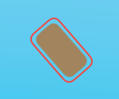
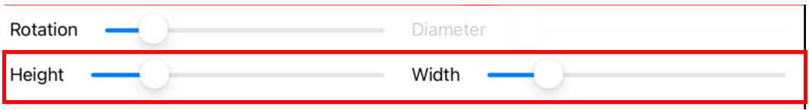
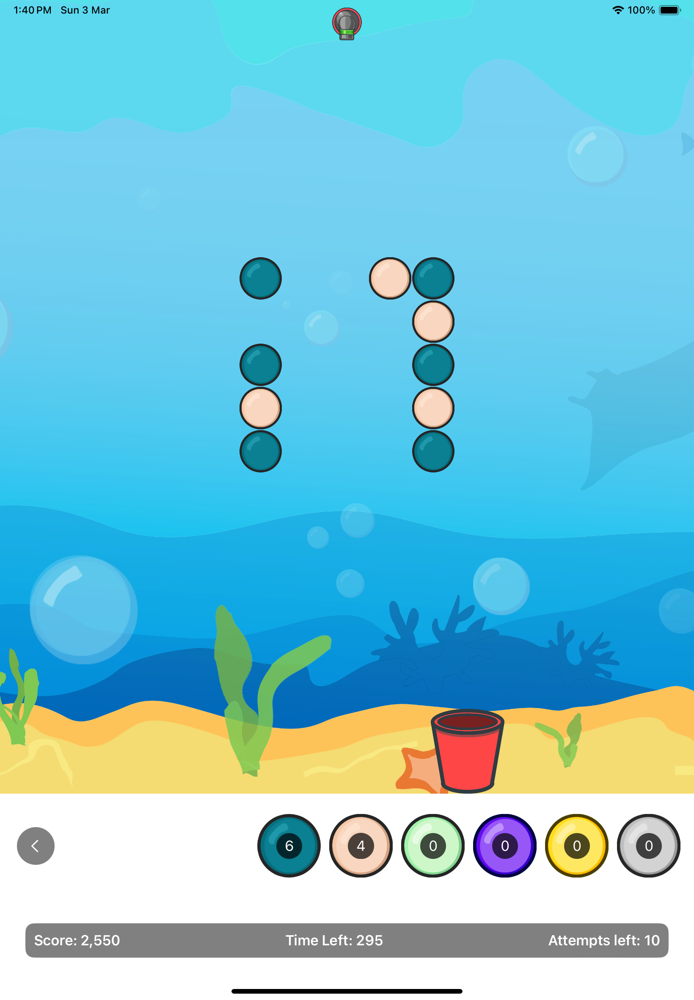
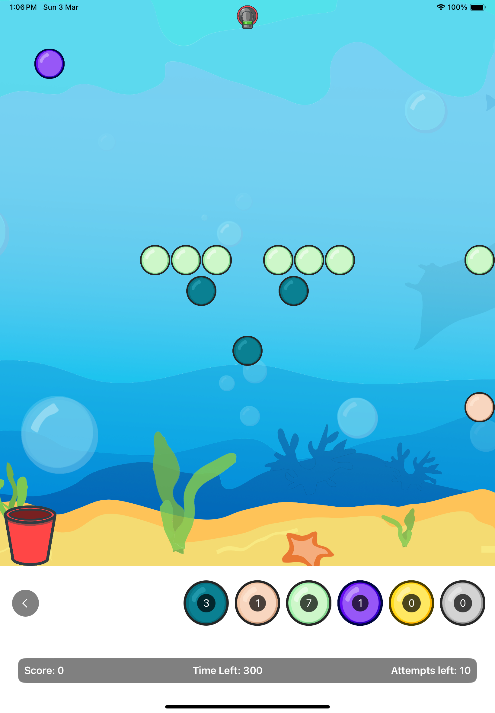

# Tests

## Unit Tests

Unit tests were done for:

Models

-   BallGameObject
-   BlockGameObject
-   BucketGameObject
-   PegGameObject
-   GameEngine
-   PhysicsObject
-   PhysicsEngine
-   Intersector
-   CollisionHandler
-   PegTests
-   BlockTests
-   GameboardTests
-   LevelDesignerViewModel
-   Persitency

> [!NOTE]
>
> -   The various PhysicsObjects are quite simple and unit testing them would be mostly just initialisation tests hence I decided to forgo them.
> -   The subclasses of PegGameObject are mostly the same so I combined them into PegGameObjectTests and tests those pegs that are different.
> -   No test done for GameViewModel and LevelSelectorViewModel as most of the functions are simply wrappers around GameEngine functions

View all unit tests [here](../PeggleClone/PeggleCloneTests/).

## Check Representations

Check representations functions were implemented for

`GameEngine`

-   The number of removed pegs must be at least 0 and not more than the total number of pegs.
-   The score must be at least 0.
-   The number of balls remaining must be at least 0.
-   If the `ball` is not `nil`, it must have a corresponding physics object in the `physicsEngine`.
-   If the `ball` is not `nil`, its position must be within the game boundary.
-   All pegs in the `pegs` array that are not in `removedPegs` must have a corresponding physics object
    in the `physicsEngine`.
-   All pegs in the `removedPegs` set must have been removed from the `physicsEngine`.
-   All blocks in the `blocks` array must have a corresponding physics object in the `physicsEngine`
-   Bucket must have a corresponding physics object in `physicsEngine`

`PhysicsEngine`

-   The array of PhysicsObject instances must not contain any duplicate objects.

`PhysicsObject`

-   The hit count must be non-negative.
-   The mass must be non-negative.
-   The elasticity must be non-negative.

`Gameboard`

-   All pegs must be within the boundaries of the gameboard.
-   All blocks must be within the boundaries of the gameboard.
-   Pegs must not overlap with each other.
-   Blocks must not overlap with each other.
-   Pegs must not overlap with blocks.
-   Must have unique identifier

`Peg`

-   Each peg has a unique identifier (`id`).
-   The peg must have a valid position. i.e. cannot have negative x or y
-   The peg must have a valid diameter. i.e. must be greater than 0
-   The peg must have a rotation.
-   The peg must have a type property (`pegtype`) indicating what kind of peg it is.

`Block`

-   Each block has a unique identifier (`id`).
-   The block must have a valid position. i.e. cannot have negative x or y
-   The block must have a valid size. i.e. height and width must be greater than 0
-   The peg must have a rotation.

> [!NOTE]
> Check representations not implemented for
>
> -   BallGameObject
> -   PegGameObject and subclasses
> -   PhysicsObject and subclasses
> -   CollisonDelegate
> -   IntersectorDelegate
>
> These models are simple with compulsory fields during initialisation and don't have much to check

## UI Tests

> [!NOTE]
> Do note when testing that:
>
> 1. Landscape is not supported, only portrait
> 2. Ball is affected by gravity so it will not fire exactly at direction of point of contact
> 3. Game should work on all ipad sizes

-   Peggle game should start at the main menu looking like this below.

-   If you tap on play you should enter the LevelSelectorView that will look like below

-   If you tap on one of the levels (e.g. Preloaded 1) it should enter GameView and look like below

> [!NOTE]
> BallView will not be visible until game starts and ball is shot

-   If you entered Level Designer instead from the main menu, you should enter LevelDesignerView that looks something like below

## Integration Tests

-   Main Menu

    -   Test PLAY button

        -   Tap on PLAY
        -   Should be led to the the LevelSelectorView

    -   Test Level Designer button
        -   Tap on Level Designer
        -   Should be led to the LevelDesignerView

-   LevelDesigner

    -   Test Normal peg button

        

        -   Blue colored button
        -   In the selected state, its opacity is increased.
        -   By default, it launches in an selected state.
        -   When tapped, it transitions from unselected to selected, causing other pegs and blocks to be unselected.
        -   If already in the selected state and tapped, it retains its selected status.

    -   Test Goal peg button

        

        -   Orange colored button
        -   In the selected state, its opacity is increased.
        -   By default, it launches in an unselected state.
        -   When tapped, it transitions from unselected to selected, causing other pegs and blocks to be unselected.
        -   If already in the selected state and tapped, it retains its selected status.

    -   Test Kaboom peg button

        

        -   Green colored button
        -   In the selected state, its opacity is increased.
        -   By default, it launches in an unselected state.
        -   When tapped, it transitions from unselected to selected, causing other pegs and blocks to be unselected.
        -   If already in the selected state and tapped, it retains its selected status.

    -   Test Spooky peg button

        

        -   Purple colored button
        -   In the selected state, its opacity is increased.
        -   By default, it launches in an unselected state.
        -   When tapped, it transitions from unselected to selected, causing other pegs and blocks to be unselected.
        -   If already in the selected state and tapped, it retains its selected status.

    -   Test Health peg button

        

        -   Yellow colored button
        -   In the selected state, its opacity is increased.
        -   By default, it launches in an unselected state.
        -   When tapped, it transitions from unselected to selected, causing other pegs and blocks to be unselected.
        -   If already in the selected state and tapped, it retains its selected status.

    -   Test Stubborn peg button

        

        -   Grey colored button
        -   In the selected state, its opacity is increased.
        -   By default, it launches in an unselected state.
        -   When tapped, it transitions from unselected to selected, causing other pegs and blocks to be unselected.
        -   If already in the selected state and tapped, it retains its selected status.

    -   Test block button

        

        -   Rectangle shaped, brown colored button
        -   In the selected state, its opacity is increased.
        -   By default, it launches in an unselected state.
        -   When tapped, it transitions from unselected to selected, causing other pegs to be unselected.
        -   If already in the selected state and tapped, it retains its selected status.
        -   Do note that blocks can never be destroyed, hence be wary when designing to avoid an unbeatable level

    -   Test Delete button

        

        -   Circular button with an arrow
        -   In the selected state, its opacity is increased.
        -   By default, it launches in an unselected state.
        -   When tapped, it toggles from unselected to selected and vice versa.
        -   Other buttons should not be affected (i.e. their opacities should not change) when delete button is tapped.
        -   If already in the selected state and tapped, it transitions from selected to unselected
        -   Whether the delete button is active or not is independednt of the selected peg/block button. (i.e. you can still select different peg/block buttons whether delete button is active or not)

    -   Test Back Button

        -   located bottom-left of screen
        -   Grey button with `<`
        -   Upon tapping it, you should be brought back to the main menu

    -   To add a peg/block onto gameboard

        -   Select the kind of peg/block you want to add by tapping the respective button
        -   When selected the button should have increased opacity
        -   Tap on the gameboard (indicated by background) the place you want to place the peg/block
        -   Ensure that the region is free of other pegs and blocks
        -   Ensure that the tapped region is not in the restricted bucket region
        -   the respective peg/block that you have selected should appear on the board

        > [!NOTE]
        >
        > -   You are unable to add peg/block in regions that overlap with other pegs or blocks
        > -   You are unable to add peg/block in region outside of the gameboard, indicated by the background
        > -   You are unable to add peg/block to the bucket region, indicated the red bar

        

        -   Do take into consideration the size of your peg/block when adding, peg/block are not allowed to be outside the board regions, bucket region, or overlapping with other pegs and blocks even partially

    -   To move a peg/block on the gameboard

        -   You can move a peg/block on the gameboard by dragging it around
        -   Same restrictions when a when adding a peg/block applies
        -   If you happen to drag a peg/block into the restricted area it should stop at the last valid location
            -   whilst still having your finger on the board, if you happen to re-enter a valid location, the peg/block should appear again at where your finger is at.

    -   To delete a peg/block

        -   To delete a peg/block you can long-press a peg. Upon releasing your finger the peg/block should be deleted
        -   Another way you can delete is to tap on the delete button (indicated by the button with the arrow).
            -   Once the button is active (indicated by increased opacity), tap on the peg/block you want to delete.
            -   Once you are done remember to toggle the disable the delete button
            -   If you do not disable the delete button, you will be unable to add other pegs

    -   To rotate a peg/block

        
        

        -   Select the peg/block you want to modify
        -   you will know it is selected as there will be a red outline over the peg/block
        -   upon selection, the rotation slider would become active (increased opacity)
        -   The slider should show the current rotation of the peg/block (i.e. if its at 90 degrees, the slider should be around 25%)

        

        -   you can adjust rotation by sliding the slider
        -   If your peg/block at a particular angle of rotation happens to overlap with other pegs/blocks or exceed the permissible area (even partially) the slider would not slide pass, and you are unable to rotate
            -   However if you continue sliding at at a larger/smaller angle and the angle of rotation no longer overlaps, the peg/block will rotate to that angle.
            -   Note that angles that cause overlaps are still not allowed (i.e. slider will never slide to an angle that causes overlap)

    -   To adjust the diameter of a peg

        -   Select the peg you want to modify
        -   You will know it is selected as there will be a red outline over the peg
        -   upon selection, the diameter slider would become active (increased opacity)

        

        -   The slider should show the current diameter of the peg (i.e. if its at 100px, the slider should be around 50%)
        -   you can adjust diameter by sliding the slider
        -   you can increase the diameter by up to 4 times original size

    -   To adjust height/width of block

        -   Select the block you want to modify
        -   You will know it is selected as there will be a red outline over the block
        -   upon selection, the height and width slider would become active (increased opacity)

        

        -   The slider should show the current height and width of the block (i.e. if its at 100px, the slider should be around 50%)
        -   you can adjust height and width by sliding the slider
        -   You can increase the height/width by up to 4 times original size

    -   To save new gameboard

        -   Before you can save ensure that there is at least one Goal peg on the gameboard. Otherwise an error message would appear.

        

        -   Select the SAVE action button
        -   A popup should appear

        

        -   Enter the name that you want to call this saved gameboard
        -   If 'OK' is selected
            -   Game should then save the gameboard into persistent memory
            -   Return back to game
        -   if 'Cancel' is selected
            -   Return back to game without saving into persistent memory

    -   To create a new gameboard

        -   Select the LOAD action button
        -   A menu containing all the previous saved gameboards should appear
        -   Select 'New Gameboard' in the menu to create a new gameboard

    -   To load gameboard

        

        -   Select the LOAD action button
        -   A menu containing all the previous saved gameboards names should appear
        -   The menu should also contain 3 preloaded levels at the top
        -   The tick indicates which gameboard is currently loaded
        -   having no tick means that there is no loaded gameboard (i.e. blank gameboard or preloaded gameboard)
        -   Find and select the name of the gameboard that you want to load in

    -   To load prelaoded levels

        -   Select the LOAD action button
        -   Select one of the 3 preloaded levels
        -   the preloaded level should be loaded onto the screen
        -   The preloaded level is loaded in as a "New Gameboard" with pegs
        -   this means that you can never modify the layout of the exisiting preloaded levels, however you can modify and save that "New Gameboard" with preloaded pegs/blocks as a new level

        -   Preloaded 1 should appear like this

        

        -   Preloaded 2 should appear like this

        

        -   Preloaded 3 should appear like this

        

    -   To override saved gameboard

        -   Load in the saved gameboard you want to override
        -   Make your modifications to gameboard
        -   Select the SAVE action button
        -   The old name of your gameboard should appear in the popup textbox
        -   Enter/Re-enter the name that you want to call this overiden gameboard
        -   In this game,
        -   If 'OK' is selected
            -   Game should then override the gameboard into persistent memory
            -   Return back to game
        -   if 'Cancel' is selected
            -   Return back to game without overriding into persistent memory

    -   To delete the saved gameboard

        -   Load in the gameboard to be deleted
        -   Select the DELETE action button
        -   Game should reload into 'New Gameboard' and delete the saved gameboard from persistent memory

    -   To clear the gameboard of all pegs

        -   Select the RESET action button
        -   Do note that this does not save or overrides into persistent memory hence when you re-load the gameboard, old pegs will still be there

    -   START action button
        -   Starts a game session with the current pegs/blocks in the LevelDesigner

-   Level Selector

    -   Check for Preloaded levels
        -   Preloaded levels should always be at the top of the list right below "New gameboard"
        -   There should be 3 Preloaded levels named
            -   Preloaded 1
            -   Preloaded 2
            -   Preloaded 3
        -   Any other levels saved should appear below the 3 preloaded levels
        -   You should be able to scroll to see all your saved levels that you have created in LevelDesigner

-   Game

    -   When tapping gameboard

        -   If the tapped position is outside the gameboard

            -   Nothing happens

        -   If the tapped position inside the gameboard

            -   Cannon should immediately rotate to the point of contact
            -   Cannon fires ball in direction of contact
            -   Balls left decrement by 1

    -   When dragging finger around gameboard

        -   If the finger position is outside the gameboard

            -   Nothing happens

        -   If the finger position is in the gameboard

            -   Cannon should swivel and aim towards direction of finger
            -   On release, cannon fire ball in direction of contact
            -   Balls left decrement by 1
            -   Cannon should be able to swivel 180 degrees from left to right. It should never aim upwards
            -   Likewise cannon ball should never fire upwards

    -   To test that ball always remain in the gameboard

        -   Select Preloaded level 3
        -   Fire at side of board at locations indicated in red.
        -   This is to test that balls will remain in gameboard despite hitting the sides of the gameboard.
            
            > [!NOTE]
            >
            > -   You may need to aim and adjust a little to hit the targetted spots
            > -   Pegs may be in the way of target, hence you might need to clear some of the pegs first
            > -   If you run out of balls, reset the game and try on the remaining untested spots
        -   Fire at the specific peg indicated below

            

        -   In both cases, ball should bounce off the boundaries downwards and not phase through the boundary

    -   To test that ball disappears after leaving gameboard

        -   Select Preloaded level 3
        -   Fire ball toward the bottom of gameboard (bypassing pegs)
        -   Ball should disappear after hitting bottom of gameboard

    -   To test that hit pegs are lit up

        -   Select Preloaded level 3
        -   Fire ball into the "ring of pegs"
        -   Check that pegs that come in contact with the ball light up
        -   Pegs that don't come in contact should not light up
        -   It should look something like this
            

    -   To test that pegs can be removed prematurely

        -   Select Preloaded level 3
        -   Fire ball into the "ring of pegs"
        -   Ball should get trapped inside the "ring of pegs"
        -   After waiting a while, pegs below the ball should fade
        -   It should look something like this
            

    -   To test that lit pegs are removed from game after ball exit

        -   Select Preloaded level 3
        -   Fire the ball into some pegs to light them up
        -   Once ball leaves, lit pegs should fade away
        -   It should look something like this
            

    -   To test gameover

        -   Gameover occurs if
            1. ran out of time
            2. there are no balls remaining
        -   To test (1)
            -   wait until time left reaches 0
        -   To test (2)
            -   Fire all balls into the bottom of gameboard (bypassing pegs)
        -   In both cases the outcome should be a pop up looking like this

            

        -   Clicking the 'OK' button should bring you back to the Level Selector or Level Designer depending on where you started the game from.

    -   To test win

        -   Win occurs if both
            -   There is time remaining
            -   All Goal pegs have been destroyed
        -   To test
            -   Repeatedly fire the balls at the pegs until all goal pegs destroyed
            -   There should be more than enough balls
            -   If you run out of balls, restart the game
        -   The outcome should be a pop up looking like this

            

        -   Clicking the 'OK' button should bring you back to the Level Selector or Level Designer depending on where you started the game from.

    -   To test multiobject collision (i.e. ball hits 2 object at the same time)

        -   Fire ball into the "ring of pegs"
        -   Observe how the ball interacts with the pegs
        -   The ball should "settle" on the bottom middle 2 pegs of "ring" and stop moving (this may take a couple tries depending on how ball moves)

            

        -   There should be any overlaps between the ball and 2 pegs
        -   This test is to ensure that collision handling even when there is 2 overlaps with ball is handled smoothly.

    -   To test ball movement

        -   Fire the ball at the pegs
        -   Observe ball motion
        -   The ball should bounce off in the direction that mirrors the incoming direction about the perpendicular at the point of contact.
        -   Ball should slow down after hitting either the boundary or pegs
        -   Balls that ascend after striking pegs should eventually descend in a parabolic trajectory, decelerating as they ascend and accelerating as they descend, provided they encounter no other obstacles.
        -   There should be no polygonal movements

    -   To test bucket

        -   Select Preloaded level 3
        -   fire at the bucket
        -   If the ball hits the side of the bucket
            -   it should bounce off
            -   no other effects
        -   If the ball hits the top of the bucket
            -   The user should gain some points
            -   the number of attempts left should increment by 1

    -   To test Kaboom

        -   Select Preloaded level 1
        -   Fire at the green peg indicated here

        

        -   The aftermath should look like this

        

        -   This aims to test
            1. the explosion radius
                - every peg within the explosion radius should be destroyed
                - Normal peg at the very bottom is not destroyed as it is out of the radius
            2. chain reaction
                - The explosion radius of the leftmost peg initially hit is not far enough to hit the right Normal peg. The fact that it is destroyed indicates that a chain reaction occured and that kaboom pegs closer to hit has destroyed it.
                - The kaboom peg right most at the edge is no where near the other kaboom pegs and thus not affect my the chain reaction (meaning not all kaboom pegs are exploded at once)
            3. Ball movement
                - A typical ball collision would reflect about the normal and slow the ball down
                - A kaboom would collision would blast the ball along the normal at high speed (altering its original direction)

    -   To test stubborn peg

        -   Select preloaded level 2
        -   Fire at the Stubborn(grey) pegs
        -   upon collision with grey peg
            -   both ball and peg should obey principle of conservation of momentum.
            -   heavier grey peg should move slower than the lighter ball
            -   peg and bounce off blocks and other pegs just like a ball would but will not cause pegs to be activated/lit up
            -   Collision with other stubborn pegs will cause the other stubborn peg to move as well
            -   Stubborn pegs cannot enter the top off the bucket and will bounce off the bucket upon collision regardless of direction of collision
        -   Stubborn pegs will only be destroyed when they exist from the bottom of the map
        -   In the rare scenario that you actually get stuck by a stubborn peg (no tests for this but you can make one in level designer), the stubborn peg should prematurely be removed

    -   To test health peg

        -   Select preloaded 2
        -   Fire at the Health(yellow) pegs
        -   upon collision ball should lose some speed and bounce off it
            -   On first hit peg should glow yellow, on ball exit peg remains
            -   On second hit peg should glow pink, on ball exit peg remains
            -   On third hit peg should turn red, on ball exit peg is destroyed
            -   beyond 3 hits, peg will be destroyed on impact

    -   To test spooky peg
        -   Select preloaded 1
        -   fire ball at spooky(purple) peg
        -   on collision ball should lose some speed and bounce off it
        -   ball should also turn purple
        -   on ball exit, it should appear above the gameboard at the same x coordinate as point of exit
        -   when ball is spooky, entering the bucket would not add an extra ball, but points still allocated.

-   Preloaded

    -   To test preloaded level 1

        -   It should look like this

        

        -   There should be 7 kaboom pegs, 3 normal pegs, 1 spooky, 1 goal peg
        -   the kaboom pegs
            -   should be exactly in the middle of the permissible gameboard height (i.e. gameboard area minus bucket region)
            -   the 2 groups of 3 kaboom pegs should be separated by 1 peg diamter
            -   There should be a single kaboom peg at the rightmost edge middle
        -   the normal pegs
            -   the should be in a triangle shape
            -   the middle normal peg should be exactly in the middle (width) of the gameboard, they should be 1 peg distance below the other 2 normal pegs (height)
            -   the left normal peg should be between the 2nd and 3rd kaboom pegs (from left)
            -   the right normal peg should be between the 4th and 5th kaboom pegs (from left)
        -   the spooky peg should be at a position 10 percent of the height and width of permissible gameboard
        -   the goal peg should be at the rightmost edge, at 80 percent of the permissible gameboard height

    -   To test preloaded level 2

        -   It should look like this

        

        -   There should be 4 blocks, 2 stubborn pegs, 3 health pegs, 1 goal peg
        -   the blocks
            -   Should be slanted at a 45 degree angle for the top-right and bottom-left
            -   Should be slanted at a 135 degree angle for the top-left and bottom-right
            -   the top left block should be at position 30 percent of permissible height and 20 percent of permissible width
            -   the top right block should be at position 30 percent of permissible height and 80 percent of permissible width
            -   the bottom left block should be at position 70 percent of permissible height and 20 percent of permissible width
            -   the bottm right block should be at position 70 percent of permissible height and 80 percent of permissible width
        -   the goal peg
            -   Should be at position 30 percent of permissible height and 60 percent of permissble width
        -   the health pegs
            -   Should be at position 30 percent of permissible height and 40 percent of permissble width
            -   Should be at position 70 percent of permissible height and 40 percent of permissble width
            -   Should be at position 70 percent of permissible height and 60 percent of permissble width
        -   the stubborn pegs
            -   Should be at position 50 percent of permissible height and 30 percent of permissble width
            -   Should be at position 50 percent of permissible height and 70 percent of permissble width

    -   To test preloaded level 3

        -   It should look like this

        
        -   There should be 7 normal pegs and 8 goal pegs
        -   they should be arranged in a box shape with an opening at the top
        -   the pegs are alternating between goal and normal pegs
        -   the box should be 5 pegs diameter in terms of height and width
        -   it should be exactly in the middle of the permissible gameboard
